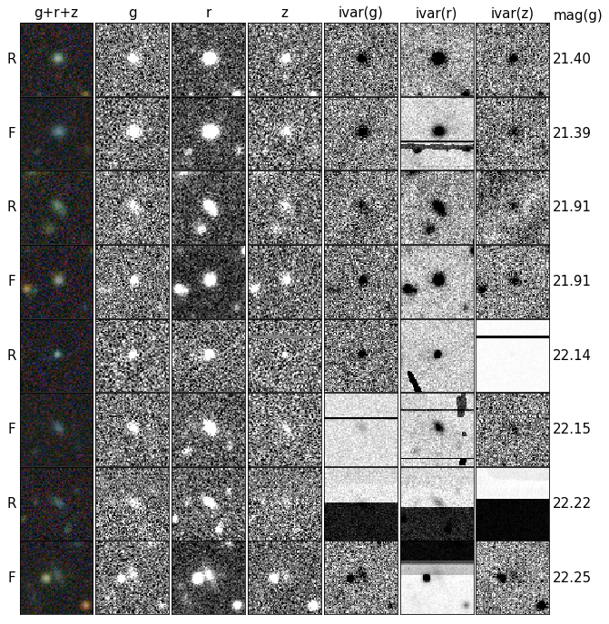
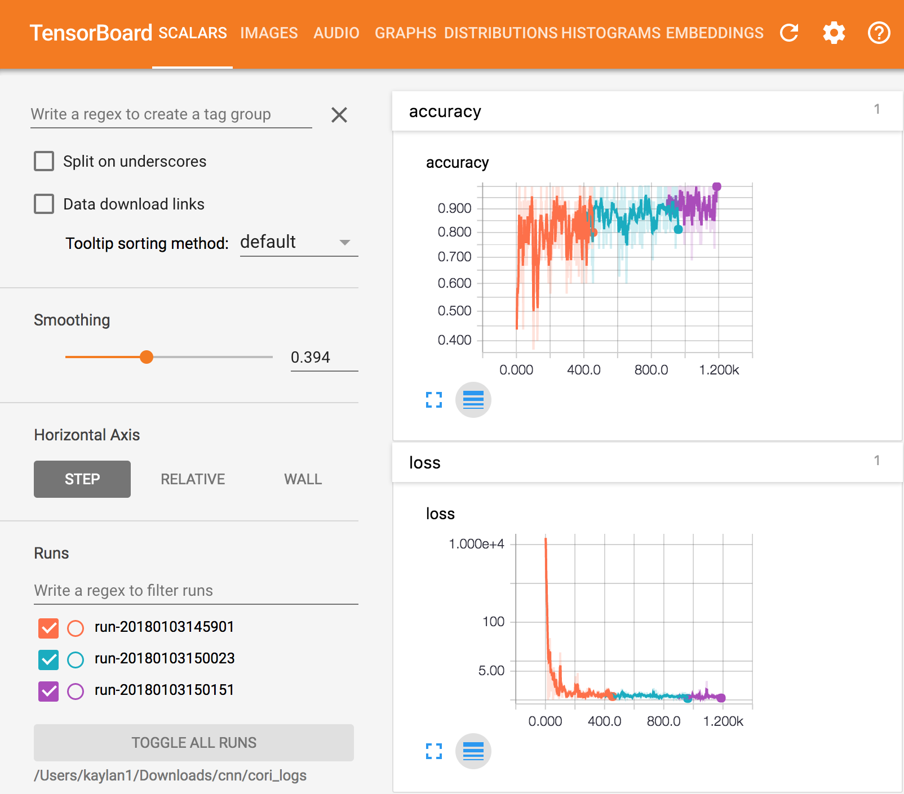
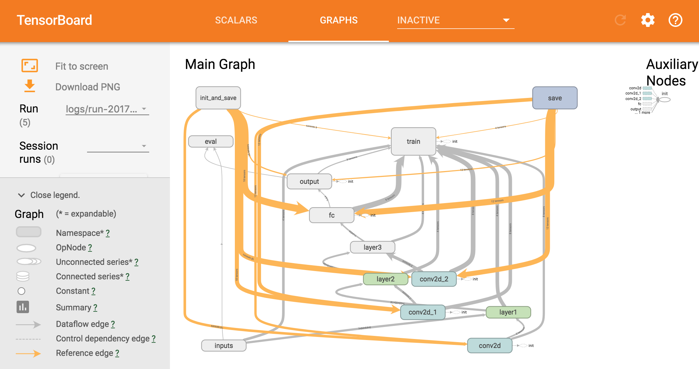
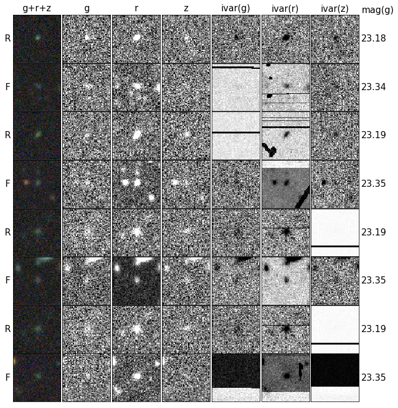
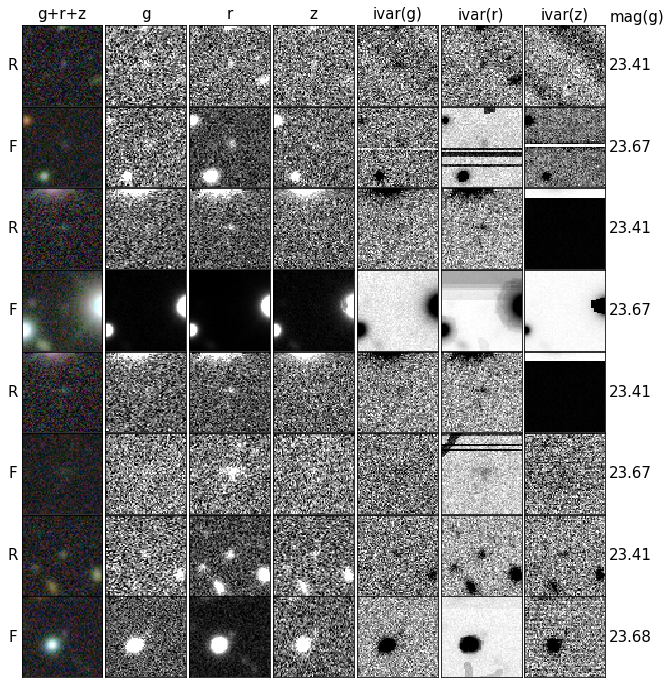
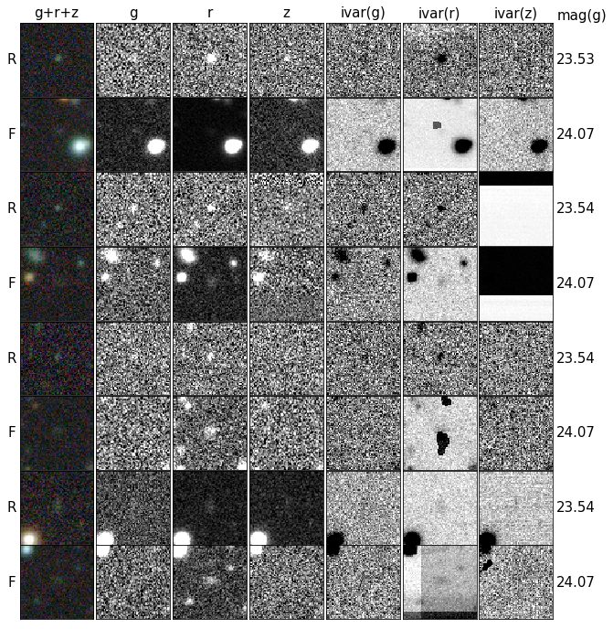
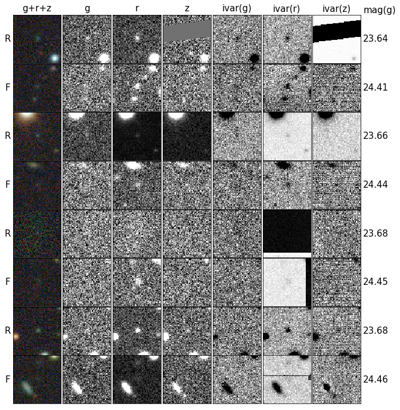

.. raw:: html
  
  <h1>Deep Learning</h1>

Can a CNN tell the difference between fake galaxies (that I inject into real imaging data) and real ones?

.. contents:: Table of Contents
  :depth: 2

Background
------------

I am getting my PhD in astrophysics from UC Berkeley. My research focuses on observational cosmology, which for me, means building an image analysis pipeline that identifies and measures properties of stars and galaxies in multi-wavelength images of the night sky. It is possible (believe it or not!) to answer questions like, “how has the expansion rate of the Universe changed over time?”, using a statistical survey of galaxies over a large enough volume of the Universe. The `Sloan Digital Sky Survey <http://www.sdss.org>`_ (SDSS) carried out such a survey by imaging about one-third of the night sky and detecting galaxies up to 6.7 billion light years away. My team is leading the `Legacy Survey <http://www.legacysurvey.org>`_. It is similar to SDSS but we use three telescopes instead of one and will detect about 30x more galaxies that can be up to 6x fainter and 3.2 billion light years further away than the SDSS galaxies. Our goal is a 2D map showing the positions of about 30 million galaxies from 100 TBs of imaging data. This is scientifically important because we can measure the distance to each galaxy from it’s spectrum (e.g. how bright it is at each wavelength of visible light). From our 3D map (distance is the third dimension), we can measure the expansion rate of the Universe at different points in time (`Eisenstein & Hu 1998 <https://arxiv.org/abs/astro-ph/9709112>`_; `Eisenstein et al. 2005 <https://arxiv.org/abs/astro-ph/0501171>`_; `Seo & Eisenstein 2007 <https://arxiv.org/abs/astro-ph/0701079>`_; `Butler et al. 2017  <https://arxiv.org/abs/1607.03150>`_).

Our survey is one of the first cosmological surveys to be entirely open source. Anyone can `download <http://archive.noao.edu/search/query>`_ the raw and calibrated images from all three telescopes within a few days of being observed. Every six months, we publicly release the results of our open source `pipeline <https://github.com/legacysurvey/legacypipe>`_ that detects and models all of the galaxies and stars in the imaging data set. I have developed many parts of the pipeline, and successfully ran it on about 30 TBs of imaging to produce our `4th public release <http://legacysurvey.org/dr4/description>`_ in June 2017. 

The primary goal of my thesis is to measure the statistical bias and variance of our pipeline. For instance, how does our survey completeness depend on whether a galaxy is bright or faint, blue or red, big or small? How well does our pipeline handle the various artifacts, every evolving list of instrument issues, and transient sources that are in our images?

To answer all of this, a professor at Siena College, John Moustakas, and I created the `obiwan code <https://github.com/legacysurvey/obiwan>`_ to do Monte Carlo simulations of our `pipeline <https://github.com/legacysurvey/legacypipe>`_. We inject fake (but realistic looking) galaxies into the current data set of images, at random locations, and then rerun the pipeline on the modified images. We expect to model about 30 million galaxies in the final data set, so we need about 10x as many fake objects to reduce standard errors on the measurements. That’s about 300 million fake galaxies.

The success of all this depends on whether or not the fake galaxies are representative of the true galaxy population. If not, I will measure our pipeline’s bias and variance for a sample of objects that do not exist in the data. I need to show that the fake galaxies have the same properties as  the real ones and that they "look" the same. Enter the Convolutional Neural Network (CNN)...

The Problem
------------

This is a supervised binary classification problem of labeled multi-wavelength images. There are 10x more fake galaxies than real ones, so the training set is at least 60 million examples. Each example is six images (64 x 64 x 6 pixels): one image for each of the three wavelength bands and three images to encode camera artifacts and the variance of each pixel. 

I am training a CNN to predict whether an image of a galaxy is model-generated (fake).  

Novel 
------

The project is novel because I want the CNN to do *poorly* even when well trained. If the CNN cannot do better than guessing the most numerous class, then the fake galaxies "look like" real ones and my model is representative of reality.

This has attracted the interest of other teammates because I am testing how realistic a model is, by injecting model-generated images into real data, and comparing against real examples elsewhere in the data. This generalizes to any model for a galaxy, star, or image artifact the group may have. 

Examples of Training Data
--------------------------

The galaxies below are some of the brightest in the training set (99th percentile in brightness). :ref:`More Examples <more-examples>` of galaxies are at the end. Those are fainter having 75th, 50th, 25th, and 1st percentiles in brightness.

   **Figure 1.** The label for each image is on the left (R for Real and F for Fake)  and its corresponding g-band magnitude is the number on the right (the smaller the number, the brighter the galaxy). Each row represents a single galaxy imaged at three different wavelengths. The color-image (left most panel) shows the colors you would see by eye, while the black and white-images (right six panels) are the training data of individual wavelength (g, r, z) and corresponding inverse variance (ivar g, r, z) images. Finally, consecutive rows of R and F (rows 1 and 2, 3 and 4, etc.) have similar g-band magnitudes so that a fair comparison can be made.

These examples and those :ref:`at the end <more-examples>` reveal at least two challenges for the CNN.

#. Only the central-object matters, but there are many off-center objects in the images. These are random background sources, often bright galaxies or stars that we are not interested in. 
#. These galaxies are very faint. The CNN must be able to dig out the low Signal to Noise sources.

CNN Architecture
-----------------

As a starting point, I used TensorFlow to build a CNN similar to LeNet-5 with the following architecture: 

.. list-table:: 
   :widths: auto
   :header-rows: 1
   :align: left

   * - Layer
     - Feature Maps
     - Size
     - Kernel Size
     - Stride
     - Activation Function
   * - Input Image
     - 6
     - 64x64
     - 
     - 
     - 
   * - Convolution
     - 18
     - 64x64
     - 7x7
     - 1
     - ReLU
   * - Avg. Pooling
     - 18
     - 32x32
     - 7x7
     - 2
     - ReLU
   * - Convolution
     - 36
     - 32x32
     - 7x7
     - 1
     - ReLU
   * - Avg. Pooling
     - 36
     - 16x16
     - 7x7
     - 2
     - ReLU
   * - Convolution
     - 54
     - 16x16
     - 7x7
     - 1
     - ReLU
   * - Avg. Pooling
     - 54
     - 8x8
     - 7x7
     - 2
     - ReLU
   * - Fully Connected
     - 
     - 64 
     - 
     - 
     - ReLU
   * - Fully Connected
     - 
     - 2 
     - 
     - 
     - Softmax

The input image has 64 x 64 x 6 pixels. With three convolution/pooling layers, the CNN is much shallower than the ImageNet ILSVRC winners, so in addition to tuning the number of feature maps, kernel size, stride, etc., I plan to make it deeper.

Xeon Phi (Knights Landing)
-----------------------------------

I created an initial data set of two million images with an equal number of “fake” and “real” examples. I randomly split that into 80% training and 20% test, storing every 512 examples (32 bit floating point) in a numpy binary file so this 50 MB file would fit in memory on most machines.

I am currently training my CNN with a batch size of 16 on Xeon Phi (Knights Landing, KNL) CPUs. This non-GPU choice was motivated by the recent addition of KNL nodes to the National Energy Research Scientific Computing Center’s (NERSC) Cray XC40 supercomputer “Cori”, and the opportunity for NERSC users to see how well their codes can scale on the new system. 

NERSC has installed many of the popular machine learning packages (Caffe, TensorFlow, Theano, Torch, see `full list <http://www.nersc.gov/users/data-analytics/data-analytics-2/deep-learning/using-tensorflow-at-nersc>`_) on Cori and optimized them for KNL. I can only train on 1 node (68 threads) because multi-node support is “coming soon,” but I’ve been told that I should be able to begin multi-node training soon because they can now scale ResNet-50 and DCGAN to 1024 KNL nodes. When that happens, I plan to assign a different batch to each MPI task, update a global set of weights after each back propagation step, and repeat.

TensorBoard & Profiling
------------------------

To show some initial results with TensorBoard, I trained the CNN on 2048 images for 4 epochs using a single KNL node. It took about 3 minutes. The accuracy, loss, and graph are below. The different colors correspond to me restarting the training twice to demonstrate that the checkpoints are working.

   Accuracy and loss with TensorBoard 

   Graph with TensorBoard

I also save profiling information (timings for each node of the graph) to a file "timing.json" using TensorFlow's `timeline <https://stackoverflow.com/questions/34293714/can-i-measure-the-execution-time-of-individual-operations-with-tensorflow>`_ object. Chrome provides a really nice way for looking at the output. Simply go to `chrome://tracing`, click `load`, and select the file. It looks like this for the 4 epochs of 2048 training images.

.. figure:: _static/prof_tensorflow.png
   :width: 90 %
   :figwidth: 90 %
   :align: center

   Profiling with TensorFlow's `timeline` and Google Chrome 

.. _deep-learn-instructions:

Instructions
-----------------

These are the instructions are for creating the training set and training the CNN at NERSC.

Create Training Data
"""""""""""""""""""""""""
* :mod:`obiwan.dplearn.create_training` (source code: `create_training.py <https://github.com/legacysurvey/obiwan/blob/master/py/obiwan/dplearn/create_training.py>`_) saves 64x64 pixels cutouts of each source in a Data Release to an HDF5 file, indexed by its unique tractor id. One HDF5 file per brick. This is done for real galaxies using an official Data Release and again for fake ones using the results from Obiwan. 

Fake galaxies occupy the narrow region of parameter space we are interested in, while real galaxies do not. The only difference in procedure between building the fake and real training sets is removing real galaxies that are outside the parameter space of interest. 

There are millions of fake and real galaxy images, so the script uses mpi4py and scales well to a few hundred Haswell nodes. I created about 1 million **real** galaxy examples using 50 Haswell nodes for 1 hour with the following SLURM job script::

    #SBATCH -p regular
    #SBATCH -N 50
    #SBATCH -t 01:00:00
    #SBATCH --account=desi
    #SBATCH -J train
    #SBATCH -L SCRATCH,project
    #SBATCH -C haswell

    let tasks=32*${SLURM_JOB_NUM_NODES}

    # NERSC / Cray / Cori / Cori KNL things
    export KMP_AFFINITY=disabled
    export MPICH_GNI_FORK_MODE=FULLCOPY
    export MKL_NUM_THREADS=1
    export OMP_NUM_THREADS=1

    srun -n ${tasks} -c 1 python create_training.py \
         --which tractor --bricks_fn bricks.txt --nproc ${tasks}
         --savedir /global/cscratch1/sd/kaylanb/obiwan_out/dr5_hdf5

For **fake** galaxies, simply replace "--which tractor" with "--which sim". The resulting HDF5 files are on at NERSC:

* real from DR5: /global/cscratch1/sd/kaylanb/obiwan_out/dr5_hdf5
* fake from Obiwan using DR5: /global/cscratch1/sd/kaylanb/obiwan_out/elg_dr5_coadds/hdf5 

Split Train/Test
"""""""""""""""""""""""

* :mod:`obiwan.dplearn.split_testtrain` (source code: `split_testtrain.py <https://github.com/legacysurvey/obiwan/blob/master/py/obiwan/dplearn/split_testtrain.py>`_) randomly shuffles the real and fake galaxies in the above HDF5 files, does a 80% training/20% test split, and repackages the results in numpy binary files.

It uses mpi4py so the same SLURM job can be used, expect with::

    srun -n ${tasks} -c 1 python split_testtrain.py \
         --bricks_fn bricks.txt --nproc ${tasks} \
         --real_dir /global/cscratch1/sd/kaylanb/obiwan_out/dr5_hdf5 \
         --sim_dir /global/cscratch1/sd/kaylanb/obiwan_out/elg_dr5_coadds \
         --save_dir /global/cscratch1/sd/kaylanb/obiwan_out/dr5_testtrain

The resulting numpy files are on at NERSC:
* /global/cscratch1/sd/kaylanb/obiwan_out/dr5_testtrain

The training data are named `[xy]train_[0-9]+.npy` and have 512 `64x64x6` examples per file. The test data are named `[xy]test_[0-9]+.npy`.

Train the CNN
"""""""""""""""""

* :mod:`obiwan.dplearn.cnn` (source code: `cnn.py <https://github.com/legacysurvey/obiwan/blob/master/py/obiwan/dplearn/cnn.py>`_) trains the CNN using TensorFlow. The following SLURM job will run on a single Knights Landing (KNL) node using 68 threads ("srun" is not needed because this is a single node job)::

    #!/bin/bash
    #SBATCH -N 1
    #SBATCH -C knl,quad,cache
    #SBATCH -p debug
    #SBATCH -J tf
    #SBATCH -t 00:30:00

    module load tensorflow/intel-head
    export OMP_NUM_THREADS=68
    export KMP_AFFINITY="granularity=fine,verbose,compact,1,0"
    export KMP_SETTINGS=1
    export KMP_BLOCKTIME=1
    export isKNL=yes

    python cnn.py --outdir /global/cscratch1/sd/kaylanb/obiwan_out/cnn

This will write three sets of metadata:

* checkpoints: /global/cscratch1/sd/kaylanb/obiwan_out/cnn/**ckpts**
* tensorboard logs: /global/cscratch1/sd/kaylanb/obiwan_out/cnn/**logs**
* profiling info: /global/cscratch1/sd/kaylanb/obiwan_out/cnn/**prof**

If checkpoints files exists, the CNN will restart training from there and the appropriate epoch and batch will be selected.

.. _more-examples:

More Examples
--------------------------------

Galaxies with *75th* perentile in brightness:

Galaxies with *50th* perentile in brightness:

Galaxies with *25th* perentile in brightness:

Galaxies with *1st* percentile in brightness (some of the *faintest* galaxies in the training set):

