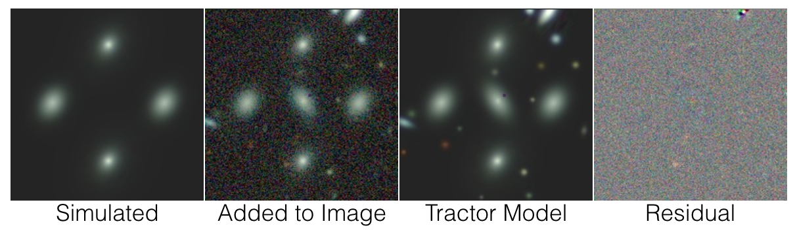

|

.. image:: _static/obiwan_logo.png
   :width: 500 px
   :align: center

|

.. title:: obiwan docs

.. toctree::
   :caption: Table of Contents

**Obiwan** is a Monte Carlo method for adding fake galaxies and stars to images from the Legacy Survey and re-processing the modified images with our `Legacysurvey/Tractor pipeline <https://github.com/legacysurvey/legacypipe>`_. The pipeline forward models galaxies and stars in the multi-color images by detecting sources with Signal to Noise (S/N) greater than 6 and minimizing the regularized L2 Loss function for various models for the shapes of stars and galaxies.

In other words, Obiwan does the following

Why the name *obiwan*?
^^^^^^^^^^^^^^^^^^^^^^^^^^^^^^^^^^^^
Just as Obi-Wan Kenobi was the *only hope* in Star Wars: Episode IV - A New Hope (`youtube <https://www.youtube.com/watch?v=0RDIJfoBhFU>`_); **obiwan**, by virtue of its Monte Carlo method, is possibly the only hope for removing all systematics in the sample of galaxies we select from the imaging data with our `Legacypipe pipeline <https://github.com/legacysurvey/legacypipe>`_. 

These are commonly referred to as "imaging systematics" since they are related to image quality, the telescope that took the image, and the bias, bugs, completeness, etc. of the `Legacypipe pipeline <https://github.com/legacysurvey/legacypipe>`_ itself. The Sloan Digital Sky Survey (SDSS), showed that these "imaging systematics" could be removed by measuring correlations between the number of galaxies and image quality (namely, stellar density, seeing, galactic extinction, sky background, and photometric offsets). The situation is more complicated for the Legacy Surveys because our images come from three telescopes, and we take exposures of the same part of the sky, in multiple bands, over timescales of years. In addition, both the cosmological signal we are looking and the cameras on the telescopes we use, have physical size of about half a degree on the night sky (this is about the size of the moon seen from Earth).

How to run the code
^^^^^^^^^^^^^^^^^^^^

Detailed instructions for running obiwan on the National Energy Research Scientific Computing Center (NERSC) supercomputers are below.

* :doc:`How to Run at Data Release <howto/PRODUCTION_RUN>`
* :doc:`Description of the outputs <howto/OUTPUTS>`
* :ref:`How to Train a CNN <deep-learn-instructions>`

Test Cases 
^^^^^^^^^^^

Insead of unit tests, we have various `end-to-end` tests of the entire piepline. We add fake galaxies to small 200x200 pixel multi-color images, run the pipeline, then assert that the measured properties of the injected  galaxies are very similar to the truth.

The Turorials section shows what these `end-to-end` tests look like, which come from this :ref:`ipython notebook <nb/TestCases.ipynb>`. We carry out the tests with :mod:`tests.end_to_end.test_datasets` python module.

Viewer
^^^^^^^

Our lead developer, `Dustin Lang <https://github.com/dstndstn>`_, made this amazing tool for looking at our imaging data:

* `legacysurvey.org/viewer <http://legacysurvey.org/viewer>`_

Questions?
^^^^^^^^^^^

* desi-image-sims 'at' googlegroups.com 

Acknowledgements
^^^^^^^^^^^^^^^^^^

See the `offical acknowledgements <http://legacysurvey.org/#Acknowledgements>`_ for the Legacy Survey.

Changelog
^^^^^^^^^^^

* :doc:`changes`

Indices and tables
^^^^^^^^^^^^^^^^^^^

* :ref:`genindex`
* :ref:`modindex`
* :ref:`search`

