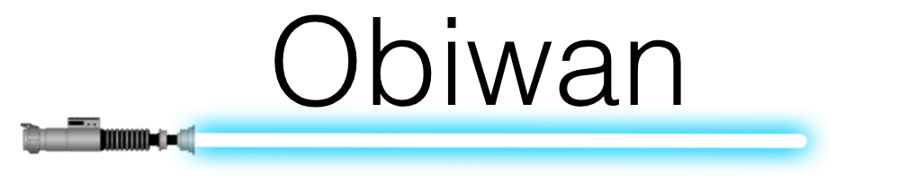
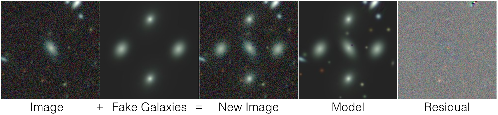

|

|

.. title:: obiwan docs

.. toctree::
   :caption: Table of Contents

**Obiwan** is a Monte Carlo method for adding fake galaxies to `Legacy Survey <http://legacysurvey.org>`_ imaging data, running our `Legacypipe <https://github.com/legacysurvey/legacypipe>`_ pipeline, and repeating. The pipeline forward models sources in multi-wavelength images by detecting Signal to Noise (S/N) greater than 6 sources and minimizing the regularized L2 Loss function for various galaxy and star models.

The `Legacy Survey <http://legacysurvey.org>`_ is one of the *first* open source cosmological surveys. Anyone can `download <http://archive.noao.edu/search/query>`_ the raw and calibrated images from all three telescopes within a few days of being observed. Every six months, we publicly release the results of our Legacypipe pipeline.

**A picture is worth a 1000 words**

Why the name *obiwan*?
-----------------------
Just as Obi-Wan Kenobi was the *only hope* in Star Wars: Episode IV - A New Hope (`youtube <https://www.youtube.com/watch?v=0RDIJfoBhFU>`_); **obiwan**, by virtue of its Monte Carlo method, is one of the only hopes for removing all systematics in the sample of galaxies we select from the imaging data.

These are commonly referred to as "imaging systematics" since they are related to image quality, the telescope, and the bias and variance of of the Legacypipe pipeline itself. The Sloan Digital Sky Survey (SDSS), showed that these "imaging systematics" could be removed by measuring correlations between the number of galaxies and image quality (namely, stellar density, seeing, galactic extinction, sky background, and photometric offsets). The situation is more complicated for the Legacy Surveys because our images come from three telescopes, and we take exposures of the same part of the sky, in multiple bands, over timescales of years. In addition, both the cosmological signal we are looking and the cameras on the telescopes we use, have physical size of about half a degree on the night sky (this is about the size of the moon seen from Earth).

Install
-----------------------

The software stack is rather complicated. ``obiwan`` is a wrapper around ``legacypipe``, which has many dependences. So there are two methods for installing everything.

**1. Docker**

Docker is the preferred method, especially for `obiwan developers` as you can run from your laptop and NERSC using the same Docker image. You can also run Jupyter notebooks, build the docs, etc. For using `obiwan` with docker see:

* :doc:`obiwan with Docker<howto/obiwan_with_docker>`

**2. desiconda**

desiconda_, maintained by Ted Kisner and monthly releases provided by Stephen Bailey, installs the DESI imaging and spectroscopic software using the Python package manager `conda`. The software is compiled specifically with the NERSC Cori and Edison supercomputers in mind. There is no simple way to install it on your laptop. For using `obiwan` with desiconda see:

* :doc:`obiwan with Desiconda<howto/obiwan_with_desiconda>`

.. _desiconda: https://github.com/desihub/desiconda

Tests
-------

We use Travis CI to run continuation integration tests for every `git push`. Because the DESI imaging pipeline has many steps it was immediately more rewarding to build "end to end tests" as opposed to unit tests. To run them do,::

  python obiwan/tests/test_200x200_pixel_regions.py

This adds four simulated galaxies and/or stars to 200x200 pixel multi-color DECaLS, MzLS, and BASS images, runs `legacypipe`, and asserts that the measured brightness and shapes of the sources are reasonably close to the truth value.

Developers
-----------

* :ref:`Building Documentation <docs-with-docker>`: Documentation is build using the Docker image

* :ref:`Jupyter Notebooks <jupyter-with-docker>`: Jupyter notebooks can be used from your laptops browser, again using the Docker image

* :ref:`Run a Brick <run-a-brick-with-docker>`: Run a brick at NERSC

.. _run-on-1000-deg2-of-sky:

Run on 1000 deg2 of sky
-----------------------

The recommended way for carrying out a many square degree of sky "production run" is by launching MPI jobs using qdo_ and using obiwan's ``runmanager`` scripts. You do the same things whether your running with Docker images or with desiconda. See

* :doc:`Run on 1000 deg2 of sky <howto/run_on_1000_deg2_of_sky>`

.. _qdo: https://bitbucket.org/berkeleylab/qdo

The outputs from running `obiwan` can be terrabytes in size, consisting of thousands of small to medium size files. To post-process and analyze these outputs see the following.

Post Processing
""""""""""""""""

The "data model" (the files obiwan outputs, what they contain, and the output directory structure) is described here:

* :doc:`Data Model <howto/data_model>`

The "post-processing", that enables later analysis and plotting, assumes the above data model and is described here:

* :doc:`Post Processing <howto/post_processing>`

The post-processing is an mpi4py script that combines all of the obiwan outputs into a few tables that make analysis and plotting a breeze.

Visualizing the millions of simulated sources you injected into the images
"""""""""""""""""""""""""""""""""""""""""""""""""""""""""""""""""""""""""""""

When running obiwan you can specify ``--stage early_coadds`` which will write coadded and simulated images, on per grz-band. Doing this for all bricks is very quick because no model fitting happens. You then run some MPI scripts that go to the location of each injected source and a 64x64 pixel cutout is extracted. This whole process only takes a few hours running on a 100 nodes and you end up with literally millions of equal-size grz cutouts of the sources you injected (and, if desired, real galaxies from positions in the data release tractor catalogues). These scripts are located in ``obiwan``'s deep learning module because this is how I built the training/test sets for my CNN. For how to do all this, see

* :ref:`Make cutouts of each simulated source <deep-learn-instructions>`

Finishing the eBOSS ELG runs
"""""""""""""""""""""""""""""""

People may be interested in finishing the eBOSS ELG runs presented in Ch 5 of my thesis. The instructions for :ref:`running on a 1000 deg2 of sky<run-on-1000-deg2-of-sky>` should guide you on how to do this, but here are some additional things you should know, such as where to find the eBOSS ELG outputs I created that are now saved to the NERSC tape archive. See:

* :doc:`Additional Info for finishing the eBOSS ELG runs <howto/finishing_the_eboss_elg_runs>`

Questions?
-----------------------

* desi-image-sims 'at' googlegroups.com

Acknowledgements
-----------------------

See the `offical acknowledgements <http://legacysurvey.org/#Acknowledgements>`_ for the Legacy Survey.

Changelog
-----------------------

* :doc:`changes`

Indices and tables
-----------------------

* :ref:`genindex`
* :ref:`modindex`
* :ref:`search`
