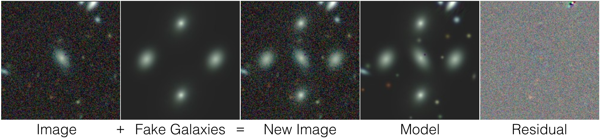

.. title:: How to reproduce my thesis results (chps 4-5)

.. toctree::
   :caption: Table of Contents

How to reproduce my thesis results (chps 4-5)
^^^^^^^^^^^^^^^^^^^^^^^^^^^^^^^^^^^^^^^^^^^^^^

My PhD thesis is available (by August 10) `here <https://search.proquest.com/dissertations/advanced?accountid=14496>`_. The following instructions show you how to
perform the production runs I carried out, analyze the outputs,
and reproduce my plots in chapters 4-5

**A picture is worth a 1000 words**

Why the name *obiwan*?
^^^^^^^^^^^^^^^^^^^^^^^^^^^^^^^^^^^^
Just as Obi-Wan Kenobi was the *only hope* in Star Wars: Episode IV - A New Hope (`youtube <https://www.youtube.com/watch?v=0RDIJfoBhFU>`_); **obiwan**, by virtue of its Monte Carlo method, is one of the only hopes for removing all systematics in the sample of galaxies we select from the imaging data.

These are commonly referred to as "imaging systematics" since they are related to image quality, the telescope, and the bias and variance of of the Legacypipe pipeline itself. The Sloan Digital Sky Survey (SDSS), showed that these "imaging systematics" could be removed by measuring correlations between the number of galaxies and image quality (namely, stellar density, seeing, galactic extinction, sky background, and photometric offsets). The situation is more complicated for the Legacy Surveys because our images come from three telescopes, and we take exposures of the same part of the sky, in multiple bands, over timescales of years. In addition, both the cosmological signal we are looking and the cameras on the telescopes we use, have physical size of about half a degree on the night sky (this is about the size of the moon seen from Earth).

How to run the code
^^^^^^^^^^^^^^^^^^^^

See below for how to run **obiwan** using the National Energy Research Scientific Computing Center (NERSC) supercomputers.

* :doc:`How to Run a Data Release <howto/PRODUCTION_RUN>`
* :doc:`Description of the outputs <howto/OUTPUTS>`
* :ref:`How to Train a CNN <deep-learn-instructions>`

Continuous Integration Tests
^^^^^^^^^^^^^^^^^^^^^^^^^^^^^^

We use `Travis <https://travis-ci.org/legacysurvey/obiwan>`_ to run `end-to-end` tests of obiwan. We add fake galaxies to small 200x200 pixel multi-color images, run the pipeline, then assert that the measured properties of the injected galaxies are within strict tolerances of what was added.

See the Tutorials `here <end-to-end-tests>` for more info.

Viewer
^^^^^^^

Our lead developer, `Dustin Lang <https://github.com/dstndstn>`_, made this amazing tool for looking at our imaging data:

* `legacysurvey.org/viewer <http://legacysurvey.org/viewer>`_

Questions?
^^^^^^^^^^^

* desi-image-sims 'at' googlegroups.com

Acknowledgements
^^^^^^^^^^^^^^^^^^

See the `offical acknowledgements <http://legacysurvey.org/#Acknowledgements>`_ for the Legacy Survey.

Changelog
^^^^^^^^^^^

* :doc:`changes`

Indices and tables
^^^^^^^^^^^^^^^^^^^

* :ref:`genindex`
* :ref:`modindex`
* :ref:`search`
